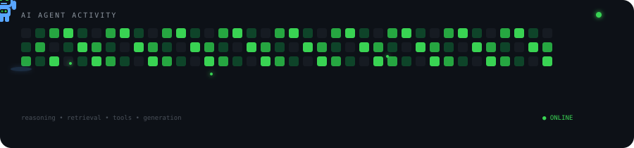

<h1 align="center">Hi 👋, I'm Mhamed Radhouane</h1>
<h3 align="center">Software Engineer in Belgium · Front-end roots · Currently diving into AI</h3>

  

<h3 align="center">🤖 Agent Activity</h3>

  

  <strong>Building at the intersection of Web Engineering × AI × Agents</strong>

  Angular & TypeScript roots → RAG → Agents → Graph-based AI

<h3 align="left">🧭 Current focus</h3>

<table>
  <tr>
    <td width="33%" align="center">
      <h4>🔎 RAG</h4>
      
Exploring retrieval, context, embeddings, and knowledge-driven LLM applications.

    </td>
    <td width="33%" align="center">
      <h4>🤖 Agents</h4>
      
Building systems where agents can reason, use tools, and collaborate on tasks.

    </td>
    <td width="33%" align="center">
      <h4>🕸️ Graphs</h4>
      
Exploring graph-based architectures for connecting knowledge, workflows, and AI.

    </td>
  </tr>
</table>

<h3 align="left">What I'm building</h3>

- [Graph-Engine](https://github.com/MhamedR/Graph-Engine) — experimenting with graph-based systems and AI workflows
- [multi-agent-pipeline](https://github.com/MhamedR/multi-agent-pipeline) — orchestrating agents that collaborate on a task
- [Retrieval-Augmented-Generation](https://github.com/MhamedR/Retrieval-Augmented-Generation) — RAG experiments in TypeScript
- [RAG-Angular](https://github.com/MhamedR/RAG-Angular) — an Angular UI on top of a RAG stack

<h3 align="left">💡 What I'm interested in</h3>

  How do we move from <strong>LLM-powered features</strong> to
  <strong>reliable AI systems</strong>?

  I'm exploring this through agents, retrieval, graphs, orchestration,
  and the engineering patterns that make AI applications useful in the real world.

<h3 align="left">Connect with me</h3>

  

